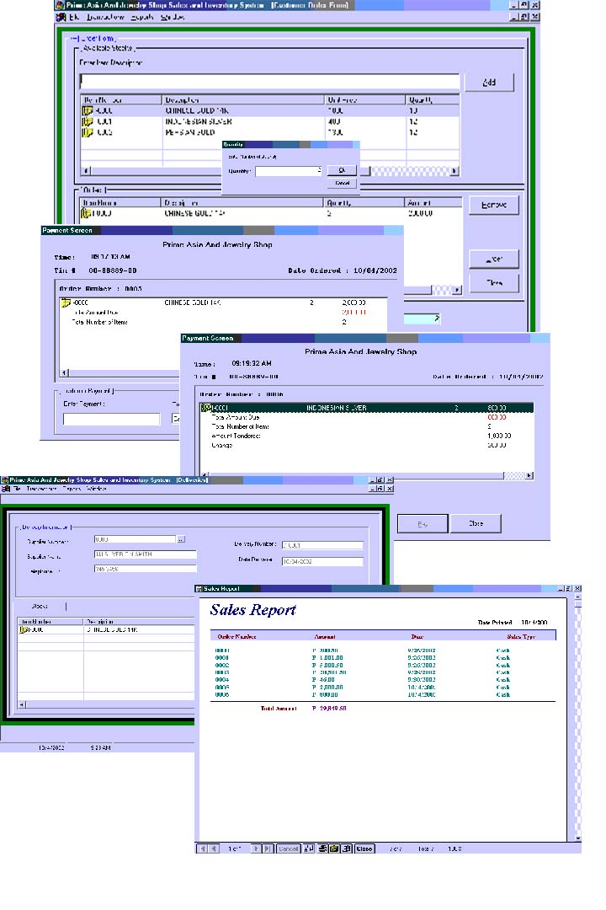



## Thesis

### Description

This is a Sales and Inventory created in Visual Basic 5 for the fulfillment of the BSCS course in Asian College of Technology in Cebu City, Philippines. It is originally programmed by Jerson Chy(super programmer) and was re-designed by Ted Antonio(computer hacker). Hope to receive messages on this system..It is complete and very useful and it can even be sold to anyone who wants it...Happy selling this product
 
### More Info
 
This is a database system created for a certain pawnshop...its great try and learn new techniques in your coding

             |
---                |---
**Submitted On**   |2002-10-26 07:42:54
**By**             |[Visual BASIC Master](https://github.com/Planet-Source-Code/PSCIndex/blob/master/ByAuthor/visual-basic-master.md)
**Level**          |Advanced
**User Rating**    |3.5 (28 globes from 8 users)
**Compatibility**  |VB 5\.0, VB 6\.0
**Category**       |[Databases/ Data Access/ DAO/ ADO](https://github.com/Planet-Source-Code/PSCIndex/blob/master/ByCategory/databases-data-access-dao-ado__1-6.md)
**World**          |[Visual Basic](https://github.com/Planet-Source-Code/PSCIndex/blob/master/ByWorld/visual-basic.md)
**Archive File**   |[Thesis1492181152002\.zip](https://github.com/Planet-Source-Code/visual-basic-master-thesis__1-40423/archive/master.zip)

